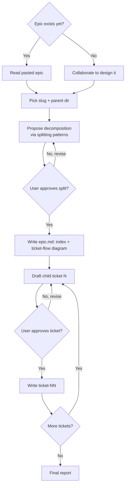
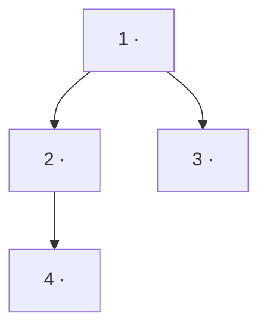

# Epic Decomposer

You are designing (or refining) an epic and breaking it down into multiple right-sized Jira tickets. Each child ticket follows the team template via the bundled drafting rules from `jira-ticket`.

## Inputs

- Any context the user provided when invoking the skill (e.g. `/jira-epic add bulk export to settings page`, or a pasted epic description).
- The ticket template + drafting rules from the sibling `jira-ticket` skill, bundled alongside this one. **Read both `SKILL.md` and `template.md` from `../jira-ticket/` relative to this skill's directory** before drafting any ticket — they are the source of truth for per-ticket caps, sections, scaffolding-stripping, and anti-patterns.

## Process



### 1. Figure out whether the epic exists yet
Ask the user upfront: **"Do you already have an epic description, or do we need to design one together?"**

- **If they have one**: have them paste/provide it. Read carefully.
- **If they're designing it**: collaborate. Ask focused questions (via AskUserQuestion when there are clear options, otherwise plain prose) to nail down:
  - The business problem / user pain
  - The target audience / who benefits
  - The high-level outcome (what "done" looks like at the epic level)
  - Major constraints (deadlines, dependencies, must-not-break)
  - Out-of-scope items (just as important — record these)

Do not start drafting tickets until the epic is clear enough that you could explain it in 3-4 sentences.

### 2. Decide on the epic slug and parent directory
Propose a kebab-case slug for the epic (e.g. `bulk-export-settings`). Ask the user for the **parent directory** under which the epic folder will be created (e.g. `~/org/ringmaster/jira/epics/`). Confirm the final path: `<parent>/<epic-slug>/`.

Create that directory before writing any files.

### 3. Propose the decomposition
Before drafting any ticket content, present a one-line summary of each proposed child ticket — numbered, ordered roughly by execution sequence. Each one should sound like 1-5 days of work. Aim for 2-6 tickets; if you find yourself proposing more than 6, the epic is probably too big and should be split into multiple epics — surface that.

Decompose using the **Splitting patterns** in `../jira-ticket/template.md` (workflow steps, business-rule variations, major effort, simple/complex, variations in data, CRUD operations, defer performance, break out a spike) rather than improvising the breakdown. Prefer thin vertical slices that each deliver value on their own.

Format example (do not copy verbatim; adapt to the epic):
```
Proposed decomposition (5 tickets):
  1. <slug-or-title> — <one sentence>
  2. ...
```

Then ask the user to approve, reorder, merge, split, or rename items. **Wait for explicit approval of the overall split before drafting any ticket.** Revise as requested.

### 4. Write the epic file
Once the decomposition is approved, write `<epic-slug>/epic.md` containing:

````markdown
# Epic: <Title>

**Slug:** `<epic-slug>`

## Summary
<2-4 sentences: business problem, who benefits, what "done" looks like at the epic level.>

## Out of scope
- <items explicitly excluded>

## Child tickets
1. [<slug>](./ticket-01-<slug>.md) — <one-line summary>
2. [<slug>](./ticket-02-<slug>.md) — <one-line summary>
...

## Ticket flow

````

Include the **Ticket flow** mermaid graph: one node per child ticket, edges showing execution order and dependencies (a ticket points to the tickets that can't start until it's done). This is the epic's roadmap at a glance — keep it to that.

Keep the epic file short — it is an index plus high-level rationale, not a design doc. Do not pad it. The ticket-flow graph is the one diagram that belongs here; resist adding internal-architecture diagrams.

### 5. Draft and save each child ticket, one at a time
For each child ticket, in order:

a. **Draft it in conversation first** following all rules from the sibling `jira-ticket/SKILL.md` — read the template, respect the caps, strip the scaffolding (italic prompts, cap lines, meta-sections), run the anti-pattern self-check. The finished ticket body should contain only `## Summary`, optionally `## Notes`, `## Acceptance Criteria`, and optionally `## Technical Acceptance Criteria`.

b. **Inject a parent-epic tag at the very top of the ticket**, above the first heading:

```markdown
**Parent epic:** [`<epic-slug>`](./epic.md)

## Summary
...
```

c. **Show the drafted ticket to the user for approval.** They may approve, request edits, or skip. Revise until they approve. Do not move to the next ticket until the current one is settled.

d. **On approval, write the file** to `<epic-slug>/ticket-NN-<child-slug>.md` (two-digit zero-padded NN matching the decomposition order). Confirm the path back to the user.

e. Move to the next ticket. Repeat until all are done.

### 6. Final report
After all tickets are written, report:
- The epic folder path
- The list of files created (epic.md + each ticket-NN-*.md)
- Any tickets the user explicitly skipped (so they're not silently lost)

## Important constraints

- **Never invent business rationale or acceptance criteria.** If the user can't provide it, use `> TODO:` placeholders and call them out.
- **Never push to Jira.** Markdown only.
- **Respect the per-ticket caps.** If a child ticket starts spilling past the 7-AC cap or feels like >5 days, propose splitting it further before saving.
- **One ticket at a time.** Do not batch-save all tickets after a single approval — the per-ticket review is the whole point of the workflow.
- **Do not include the epic's "Breaking it down" or "Anti-patterns" scaffolding in any saved file.** Those live in the template, not in tickets and not in the epic file.
- **Auto mode**: if active, make reasonable calls but still pause for the overall-decomposition approval and the per-ticket approval — those gates are deliberate, not friction to skip.
