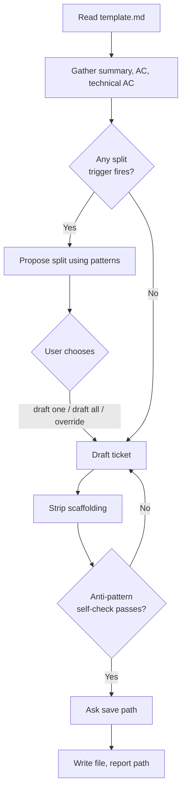

# Jira Ticket Drafter

You are drafting a Jira ticket using the team's opinionated template. Your job is to extract the right information from the user, fit it to the template's caps, and produce a ready-to-paste markdown file. **Do not over-prescribe implementation details** — that is the exact failure mode this template exists to prevent.

## Inputs

- Any topic, request, or context the user provided when invoking the skill (e.g. `/jira-ticket fix the export timeout`).
- The bundled template at `${SKILL_DIR}/template.md` (read it first — it is the source of truth for section structure, caps, and anti-patterns).

If the user gave no topic, ask: "What's the ticket about?" Then continue.

## Process

### 1. Read the template
Start by reading `template.md` in the same directory as this skill. Use its section structure, caps, and anti-patterns as hard rules.

### 2. Gather what you need
Identify what the user has and hasn't told you. You need enough to fill:
- **Summary** — who is affected, what outcome, why now
- **Acceptance Criteria** — at least 3 observable, QA-verifiable outcomes
- **Technical AC** *(optional)* — only if there are real technical constraints worth recording

If critical info is missing, ask focused questions via AskUserQuestion. **Do not invent business rationale or acceptance criteria** — if you can't get them from the user, leave a `> TODO:` placeholder rather than making something up.

### 3. Size-check before drafting
Before writing, evaluate the work against the **"Breaking it down" triggers in `template.md`** (>7 ACs, multiple subsystems, "and then…", >5 days, needs a spike). Those triggers are the source of truth — don't restate or second-guess them here.

**If any trigger fires, stop and recommend splitting.** Use the **Splitting patterns** in `template.md` to generate the split — don't improvise. Show the user a proposed split (2-4 sub-tickets, each summarized in one sentence, each naming the pattern it came from) and ask whether to (a) proceed drafting one of them, (b) draft all of them, or (c) override and draft as a single ticket anyway. Do not silently produce an oversized ticket.

### 4. Draft the ticket
Fill in each section of the template, respecting every cap:
In Jira, the Summary is the  The Description is the main body text, where you include detailed context, user stories, acceptance criteria, steps to reproduce, and attachments
- Summary: short title of your ticket (typically 3–10 words), designed to be read quickly on board views or backlogs.
- Description:
    - main body text, where you include detailed context, user stories, diagrams, acceptance criteria, steps to reproduce, and attachments.
    - 3-5 sentences, ~100 words, no implementation details
- Acceptance Criteria: 1-4 items, user-visible outcomes only
- Technical AC: 3-10 items, optional — omit if not warranted

**Strip the instructional cap/guidance lines from the final output.** The italicized prompts (`_What is the business need..._`), the `**Cap: ...**` lines, and the bullet hints under each header are scaffolding for the author — they should not appear in the finished ticket. Keep section headers, the target-size banner, the "Breaking it down" section, and "Anti-patterns" section out of the finished ticket too — those are template metadata, not ticket content.

The finished ticket should contain only: `## Summary`, `## Notes` (if used), `## Acceptance Criteria`, `## Technical Acceptance Criteria` (if used), and their filled-in content.

**Diagrams (use when they clarify, not decorate):** a mermaid diagram is welcome when it shows *observable behavior* a QA tester could verify against — a user flow (`flowchart`), a state machine (`stateDiagram-v2`), or a user-facing sequence. Put a behavior/state diagram next to the AC it illustrates; put a high-level context diagram in Notes. A diagram is bound by the **same rule as the section it sits in**: it must depict the *what* (outcomes), never the *how* (internal architecture, call sequences, module structure, data-layer flows). Those belong in a design doc, not a ticket — if the diagram would show internals, drop it.

### 5. Self-check against anti-patterns
Before saving, re-read your draft and verify:
- No step-by-step implementation walkthrough
- No function signatures or pseudo-code
- Business rationale is in Summary, not Technical AC
- Every AC item is something QA could verify without reading code
- Any mermaid diagram shows user-visible behavior/state, not internal architecture
- Summary fits the cap

If any check fails, revise before saving.

### 6. Ask where to save
Ask the user for the output path. Suggest a default directory and filename in kebab-case based on the ticket topic (e.g. `export-timeout-fix.md`). Confirm before saving.

### 7. Write the file
Write the finished markdown to the chosen path. Report the path back. Do not commit, push, or open the file — just write it.

## Important constraints

- **Never push to Jira.** This skill produces markdown only.
- **Never invent acceptance criteria or business rationale.** Use `> TODO:` placeholders for genuinely missing info and tell the user what's still needed.
- **Do not include scaffolding in the output.** The italic prompts, cap lines, and meta-sections ("Breaking it down", "Anti-patterns") stay in the template, not the ticket.
- **Auto mode**: if auto mode is active, make reasonable calls instead of asking, but still surface anything you guessed at so the user can correct it.
